# JEPA Study Guide: From Fundamentals to ICRA Research

A comprehensive, hands-on learning path for understanding **JEPA** (Joint Embedding Predictive Architecture) and its applications in robotics, VLA models, video prediction, and safe humanoid control.

**5 interactive Jupyter notebooks** with 250+ cells, 30+ animated GIFs, 80+ visualizations (2D/3D/4D/5D), runnable toy models, layer-by-layer analysis, formal math, layman analogies, and complete 5W+1H glossaries for every key term.

---

## Table of Contents

1. [Project Overview](#1-project-overview)
2. [Prerequisites and Setup](#2-prerequisites-and-setup)
3. [Learning Path (Day-by-Day Plan)](#3-learning-path-day-by-day-plan)
4. [Key Results and Visualizations](#4-key-results-and-visualizations)
5. [Formula Reference Card](#5-formula-reference-card)
6. [Glossary](#6-glossary)
7. [Reference Papers](#7-reference-papers)
8. [Hardware and Compute](#8-hardware-and-compute)

---

## 1. Project Overview

### What This Project Is

A self-contained study guide that takes you from zero knowledge of JEPA to being ready to write an ICRA (IEEE International Conference on Robotics and Automation) research paper on JEPA-based Vision-Language-Action models. Every concept is explained with formal math, plain-English analogies, runnable code, and animated visualizations.

### Who It's For

- **Beginners** entering the JEPA / VLA / robotics AI space
- **Graduate students** preparing ICRA or other robotics conference submissions
- **Practitioners** who want to understand V-JEPA 2 and action-conditioned world models at the source-code level
- **Anyone** who learns best by building things and watching them work

### What You'll Learn (A to Z)

- Action chunking and why robots predict multiple steps at once
- Action conditioning: how actions enter the transformer sequence
- Attention mechanisms: multi-head self-attention with hand-computed examples
- Autoregressive rollout and compounding error
- Causal attention masks for world models
- CEM (Cross-Entropy Method) planning in latent space
- Control Barrier Functions (CBFs) for safe robot control
- EMA (Exponential Moving Average) for stable target networks
- Flow matching: denoising noise into robot actions
- Gated cross-attention for multimodal fusion
- Gradient flow and backpropagation through JEPA
- I-JEPA, V-JEPA, V-JEPA 2 architecture evolution
- JEPA-VLA: plugging JEPA features into existing VLAs
- L1 loss and why it outperforms L2 for representation learning
- LayerNorm vs BatchNorm in transformers
- LIBERO benchmark suite for manipulation evaluation
- Masking strategies: multi-block 3D masking for video
- Patch embeddings and the lifecycle of a patch
- Representation collapse and how stop-gradient prevents it
- Residual connections and the residual stream
- RoPE (Rotary Position Embedding) in 3D for video
- Sim-to-real transfer with JEPA world models
- SwiGLU activation function
- Teacher-forcing vs autoregressive training
- VLA (Vision-Language-Action) model comparison: RT-2, Octo, OpenVLA, pi0
- VLA-JEPA: building a VLA with a JEPA world model
- ViT (Vision Transformer) architecture
- Weight initialization rescaling trick
- World models: pixel-space vs latent-space prediction

---

## 2. Prerequisites and Setup

### Requirements

- **Python 3.11+**
- **No GPU required** -- all examples use CPU-runnable toy models
- ~2 GB disk space (including reference repos)

### Installation

**Option A: Using uv (recommended)**

```bash
git clone <this-repo>
cd JEPAstudy

uv venv --python 3.11
# Linux/macOS:
source .venv/bin/activate
# Windows:
.venv\Scripts\activate

uv sync
```

**Option B: Using pip**

```bash
git clone <this-repo>
cd JEPAstudy

python -m venv .venv
# Linux/macOS:
source .venv/bin/activate
# Windows:
.venv\Scripts\activate

pip install torch torchvision --index-url https://download.pytorch.org/whl/cpu
pip install numpy matplotlib scikit-learn scipy jupyter nbconvert ipykernel
```

### Running the Notebooks

```bash
jupyter notebook notebooks/
```

Open notebooks in order: `01` through `05`. Each notebook is self-contained and generates all its own plots and GIFs when run.

### Dependencies

Defined in `pyproject.toml`:
- `torch` and `torchvision` (CPU build)
- `matplotlib`, `numpy`
- `jupyter`, `nbconvert`, `ipykernel`

Additional packages used by individual cells (installed automatically or via pip): `scikit-learn`, `scipy`.

---

## 3. Learning Path (Day-by-Day Plan)

### Day 1: JEPA Fundamentals (Notebook 01) -- Estimated 6-8 hours

**File:** `notebooks/01_JEPA_Fundamentals.ipynb` (92 cells)

**Topics covered:**
- What problem JEPA solves (predict in latent space, not pixel space)
- The JEPA objective: encoder, target encoder, predictor
- 5W+H of JEPA: Who, What, Where, When, Why, How
- Building a toy JEPA from scratch on synthetic data
- Masking strategy implementation
- Training loop with L1 loss
- Why stop-gradient prevents representation collapse (with live demo)
- EMA update rule and momentum comparison
- Layer-by-layer activation analysis (mean, variance, kurtosis)
- Gradient flow analysis through the network
- 3D loss landscape visualization
- Representation space analysis (PCA, t-SNE, UMAP in 2D and 3D)
- Ablation study: hyperparameter sensitivity
- Attention pattern evolution during training
- Mutual information between layers
- L1 vs L2 loss comparison
- The `apply_masks` gather operation from V-JEPA 2 source code
- Complete 5W+1H glossary (10 terms)
- Higher-dimensional visualizations (4D and 5D)
- Formal mathematical derivations (collapse prevention, loss gradient, information theory)
- Hand-computed JEPA forward pass with every matrix multiply traced
- The lifecycle of a patch through the entire pipeline
- LayerNorm vs BatchNorm deep dive
- Backpropagation walkthrough with chain rule
- Tensor dimension reference (every shape through the network)
- Softmax numerical stability and the LogSumExp trick
- JEPA debugging playbook (symptoms, diagnosis, fixes)
- Training monitoring dashboard
- Self-assessment quiz (3 difficulty levels)
- Reading guide for every plot and GIF

**Key outputs:**
- Training loss curve converging over 200+ epochs
- t-SNE/PCA clusters showing learned representations
- 3D loss landscape surface showing optimization path
- Ablation heatmap showing sensitivity to EMA momentum and learning rate
- Collapse demonstration: all representations converge to a single point without stop-gradient

**Self-check -- after Day 1, you should be able to:**
- Explain why JEPA predicts in latent space instead of pixel space
- Write the JEPA loss function from memory
- Describe what happens if you remove the stop-gradient
- Explain why EMA momentum of 0.996 works better than 0.5 or 0.999
- Sketch the data flow through encoder, target encoder, and predictor

---

### Day 2: V-JEPA 2 Architecture (Notebook 02) -- Estimated 4-6 hours

**File:** `notebooks/02_VJEPA2_Architecture.ipynb` (62 cells)

**Topics covered:**
- V-JEPA 2 architecture overview and design rationale
- 5W+H of V-JEPA 2's architecture choices
- PatchEmbed3D: converting video frames to patch tokens
- 3D Rotary Position Embeddings (3D RoPE) with numerical walkthrough
- Self-attention: the full matrix math (Q, K, V projections)
- Transformer Block: residual connections, LayerNorm, SwiGLU FFN
- Weight initialization: the rescaling trick from V-JEPA 2 source
- Mini V-JEPA 2 implementation (CPU-runnable)
- Full encoder forward pass with shape tracking at every layer
- Tensor statistics across all layers (mean, std, norm)
- Multi-head attention analysis: what each head attends to
- 3D visualization of patch embeddings in space
- RoPE frequency spectrum and rotation visualization in 3D
- Layer-wise representation similarity (CKA analysis)
- Gradient norms and parameter statistics per layer
- Token mixing: how information flows between patches
- The predictor architecture and why it is smaller than the encoder
- V-JEPA 2 model family sizes (ViT-Large, ViT-Huge, ViT-giant)
- Complete 5W+1H glossary (6 terms: ViT, RoPE, SwiGLU, MHA, LayerNorm, Residual Connection)
- Hand-computed multi-head attention (2 heads, 4 patches, 8 dimensions)
- The residual stream: how information actually flows through 12 layers
- Self-assessment quiz with reading guide for all plots

**Key outputs:**
- Attention heatmaps per head per layer showing specialization
- 3D patch embedding scatter showing spatial structure preservation
- RoPE rotation visualization showing how positions are encoded
- CKA similarity matrix showing which layers learn similar representations
- Token mixing flow diagrams
- Weight initialization comparison: standard vs rescaled vs zero-init

**Self-check -- after Day 2, you should be able to:**
- Explain how a video is converted into patch tokens
- Describe how RoPE encodes 3D position (time, height, width) through rotation
- Write the SwiGLU formula and explain why gating helps
- Explain the rescaling trick and why it prevents activation explosion
- Trace a tensor's shape through the full encoder forward pass

---

### Day 3: Action-Conditioned World Model (Notebook 03) -- Estimated 4-6 hours

**File:** `notebooks/03_VJEPA2_AC_WorldModel.ipynb` (52 cells)

**Topics covered:**
- V-JEPA 2-AC: bridging self-supervised video understanding to robot control
- 5W+H of action-conditioned world models
- Action and state representation (7-DoF robot actions, proprioceptive state)
- Frame-causal attention mask: step-by-step construction
- Token interleaving: how action tokens enter the sequence
- ACRoPEAttention: separate RoPE for action vs spatial tokens
- Teacher-forcing loss: training with ground-truth inputs
- Autoregressive rollout loss: training with own predictions
- Combined loss function (V-JEPA 2-AC)
- CEM planning in latent space: energy function and sampling
- ACBlock implementation and analysis
- Causal mask step-by-step construction and visualization
- Attention weight analysis in the action-conditioned model
- 3D visualization: rollout quality vs planning horizon
- Action embedding space analysis (t-SNE and PCA)
- Loss decomposition: teacher-forcing vs autoregressive components
- Complete 5W+1H glossary (6 terms: World Model, Action Conditioning, Teacher-Forcing, Autoregressive Rollout, CEM, Frame-Causal Attention)
- Mathematical deep dive: world model training losses
- The robot decision loop at 10 Hz
- Teacher-forcing vs autoregressive side-by-side with numbers
- Robot action space: 7-DoF commands explained
- Frame-causal attention: why the future must be hidden
- Training monitoring dashboard for V-JEPA 2
- With vs without actions: why action conditioning changes everything
- Self-assessment quiz with reading guide

**Key outputs:**
- Causal mask visualization showing frame-level blocking structure
- CEM planning convergence showing samples narrowing around the optimal trajectory
- Rollout error accumulation: teacher-forcing stays accurate, autoregressive drifts
- Action embedding clusters in t-SNE space
- Loss decomposition showing the balance between TF and AR loss components
- Side-by-side comparison: conditioned vs unconditioned prediction trajectories

**Self-check -- after Day 3, you should be able to:**
- Explain the difference between a world model in pixel space vs latent space
- Draw the causal attention mask for 4 frames with action tokens
- Describe why teacher-forcing alone is not sufficient (exposure bias)
- Explain how CEM iteratively refines action sequences
- Write the combined loss function for V-JEPA 2-AC

---

### Day 4: VLA-JEPA Integration (Notebook 04) -- Estimated 3-5 hours

**File:** `notebooks/04_VLA_JEPA_Integration.ipynb` (43 cells)

**Topics covered:**
- Two approaches to JEPA + VLA integration
- 5W+H of JEPA-based VLAs
- **JEPA-VLA** (feature injection): plugging V-JEPA 2 features into existing VLAs
- **VLA-JEPA** (world model): building a VLA with an integrated JEPA world model
- Leakage-free design: the critical innovation in VLA-JEPA
- VLA-JEPA two-stage training: JEPA pretraining then action head fine-tuning
- Comparative analysis of both approaches for ICRA
- LIBERO benchmark results comparison
- End-to-end pipeline flow visualization with tensor shapes
- Fusion mechanism comparison (4 methods)
- Flow matching deep dive: vector fields in 2D and 3D
- Action distribution analysis (2D and 3D)
- Open research gaps (5 gap areas for ICRA papers)
- Complete 5W+1H glossary (6 terms: VLA, JEPA-VLA, VLA-JEPA, Flow Matching, Gated Cross-Attention, LIBERO)
- Flow matching mathematical derivation
- Action chunking: why robots predict multiple steps at once
- Complete VLA pipeline walkthrough: every tensor shape traced
- VLA model comparison chart (RT-2, Octo, OpenVLA, pi0, JEPA-VLA, VLA-JEPA)
- Self-assessment quiz with reading guide

**Key outputs:**
- End-to-end pipeline diagram showing tensor shapes at every stage
- Flow matching GIF: noise particles transforming into bimodal action distributions
- 2D flow field snapshots showing velocity vectors at multiple timesteps
- 7-DoF denoising plot showing all action dimensions converging simultaneously
- VLA architecture comparison chart (6 models side-by-side)

**Self-check -- after Day 4, you should be able to:**
- Explain the difference between JEPA-VLA (feature injection) and VLA-JEPA (world model)
- Describe what "leakage-free" means and why it matters for world model training
- Write the flow matching loss function
- Explain action chunking and its tradeoffs (chunk size vs reactivity)
- List 3 open research gaps where JEPA + VLA integration can improve

---

### Day 5: ICRA Research Gaps (Notebook 05) -- Estimated 3-4 hours

**File:** `notebooks/05_ICRA_Research_Gaps.ipynb` (45 cells)

**Topics covered:**
- Landscape map: what exists vs what is missing in JEPA research
- 5W+H of JEPA for ICRA research
- **Paper Idea 1: Safe JEPA-VLA** -- CBF in latent space (medium risk)
- **Paper Idea 2: Unified JEPA-VLA** -- combining feature injection + world model (recommended)
- **Paper Idea 3: Amortized Planning** -- distill CEM into a policy
- **Paper Idea 4: Sim-to-Real Transfer** -- JEPA world model for domain adaptation
- CBF mathematics for JEPA latent space (full derivation)
- Unified JEPA-VLA complete architecture pseudo-code
- Ablation study design: what to measure in your ICRA paper
- Compute and memory profiling for your hardware
- Implementation roadmap (16 weeks, 4 phases)
- How to write an ICRA paper: structure, reviewer expectations, checklist
- How CBFs work in latent space: the full math
- How to design reproducible experiments: statistical rigor, power analysis
- Quick-start guide for getting VLA-JEPA code running
- Loading pretrained V-JEPA 2 via PyTorch Hub
- 5W+1H glossary (3 terms: CBF, Sim-to-Real, Amortized Planning)
- Self-assessment quiz with reading guide

**Key outputs:**
- CBF safety filter GIF: comparing unsafe vs CBF-filtered trajectories
- CBF navigation GIF: real-time obstacle avoidance
- Latent CBF visualization: 4-panel plot showing safety boundaries in latent space
- CBF QP correction plot: how the quadratic program modifies unsafe actions
- Experiment bar charts: expected LIBERO benchmark results
- Radar chart: comparing paper ideas across 5 dimensions (novelty, feasibility, impact, risk, publication readiness)
- Statistical power analysis plot for experiment design
- 16-week Gantt chart for the research timeline
- Compute plan: GPU hours and memory estimation
- VRAM estimation chart for different model sizes

**Self-check -- after Day 5, you should be able to:**
- Pitch the Unified JEPA-VLA paper idea in 2 sentences
- Explain how a CBF can enforce safety constraints in latent space
- Describe the 4-phase research implementation plan
- List the 3 things ICRA reviewers care about most
- Design an ablation study with proper baselines and statistical tests

---

## 4. Key Results and Visualizations

### Notebook 01: JEPA Fundamentals

**Animated GIFs:**

| GIF | What It Shows | What to Observe |
|-----|---------------|-----------------|
| 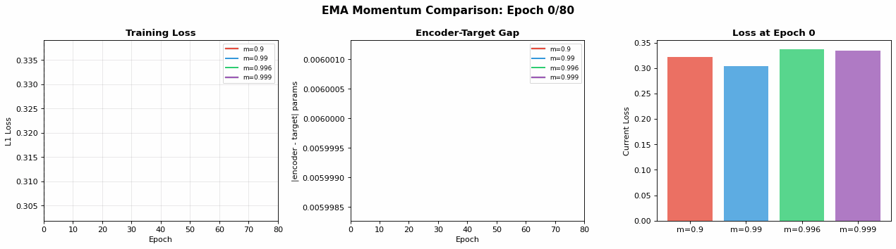 | Side-by-side training with different EMA momentum values (e.g., 0.5, 0.9, 0.996, 0.999) | Low momentum (0.5) causes unstable training with oscillating loss. High momentum (0.996) provides smooth convergence. Very high (0.999) tracks too slowly and underperforms early on. |
| 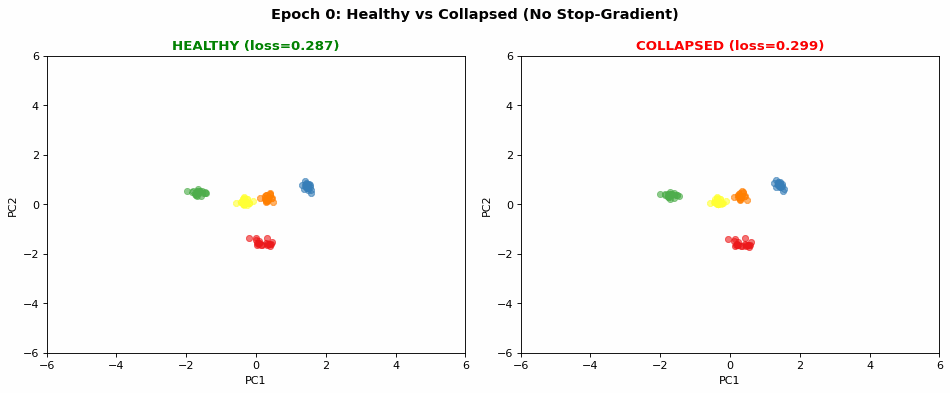 | Side-by-side: healthy JEPA training vs training without stop-gradient | Healthy training develops distinct clusters in representation space. Without stop-gradient, all representations collapse to a single point -- the model predicts a constant regardless of input. |
| 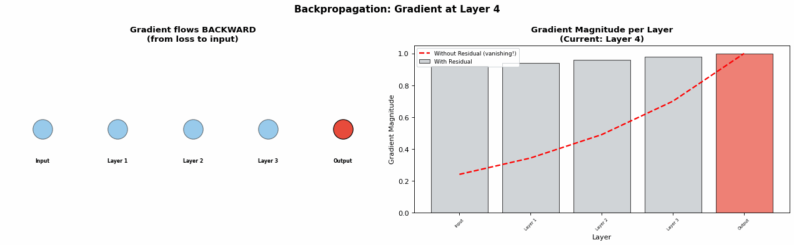 | Gradient magnitudes flowing backward through the network during training | Gradients should remain roughly the same magnitude across layers. Watch for vanishing (bars shrinking to zero) or exploding (bars growing large) gradients. Residual connections keep flow healthy. |
| 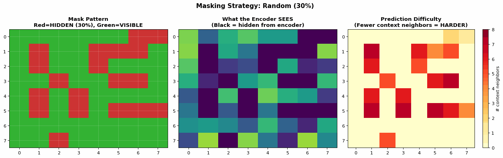 | Different masking patterns applied to a grid of patches | Each frame shows a different random multi-block mask. Notice how context patches (visible) and target patches (masked) are complementary. The model must predict targets from context. |
| 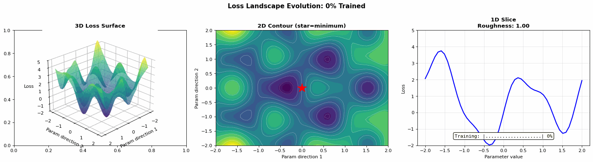 | 3D surface of the loss function evolving as training progresses | Early: rough, multi-modal landscape with many local minima. Late: smoother landscape with a clear global minimum. The optimization trajectory should trend downhill. |

**Key plots:**
- **Training loss curve**: L1 loss decreasing smoothly over 200+ epochs, proving the toy JEPA learns meaningful representations
- **t-SNE / PCA / UMAP scatter**: Clusters of similar inputs form distinct groups, confirming the encoder learns semantic structure
- **3D loss landscape surface**: Shows the optimization terrain the model navigates during training
- **Ablation heatmap**: Grid of (learning rate x EMA momentum) showing how different hyperparameter combinations affect final loss
- **Attention pattern evolution**: Attention maps becoming more structured (less uniform) as training progresses
- **Mutual information matrix**: Shows which layers share the most information, revealing the network's internal structure

---

### Notebook 02: V-JEPA 2 Architecture

**Animated GIFs:**

| GIF | What It Shows | What to Observe |
|-----|---------------|-----------------|
| 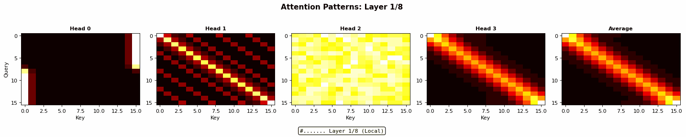 | Attention heatmaps evolving from layer 1 to layer 12 | Early layers show broad, diffuse attention (every patch attends to everything). Deeper layers develop sharp, specialized patterns -- some heads focus on spatial neighbors, others on semantically similar patches. |
| 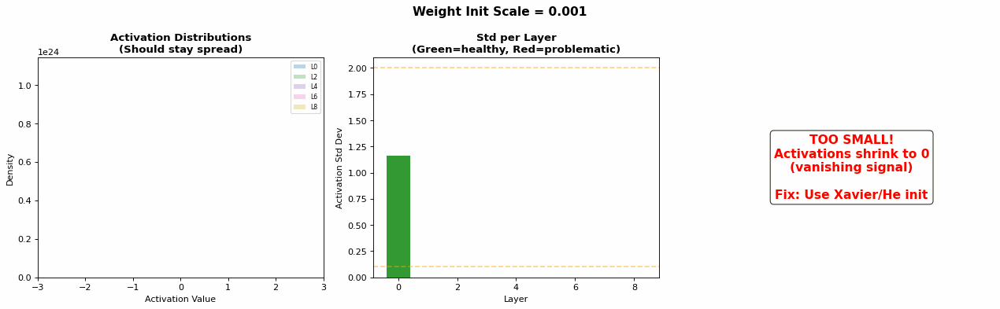 | Activation distributions under different weight initialization strategies | Standard init may cause activations to explode or vanish through layers. The V-JEPA 2 rescaling trick keeps activations stable (consistent variance) across all 12 layers. |
| 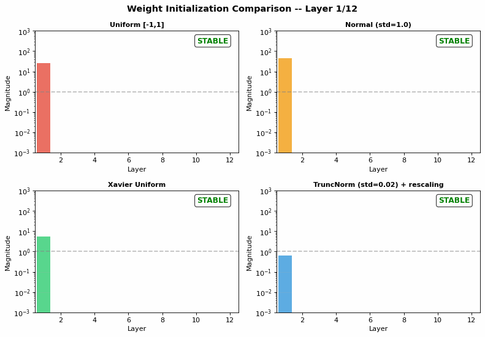 | Activation propagation animation for each initialization strategy across layers | Compare how standard Xavier, Kaiming, and the V-JEPA 2 rescaling trick affect signal propagation. The rescaling trick produces the most stable activations across depth. |

**Key plots:**
- **Multi-head attention maps**: Per-head heatmaps showing what each head specializes in
- **3D patch embeddings**: Scatter plot showing that spatially close patches have similar embeddings
- **RoPE frequency spectrum**: Visualization of how different frequency bands encode position at different scales
- **CKA similarity matrix**: Shows that early and late layers learn different representations, while middle layers are most similar to each other
- **Gradient norms per layer**: Confirms the rescaling trick prevents gradient explosion
- **Token mixing flow**: Shows how information from one patch spreads to others through attention

---

### Notebook 03: V-JEPA 2-AC World Model

**Animated GIFs:**

| GIF | What It Shows | What to Observe |
|-----|---------------|-----------------|
| 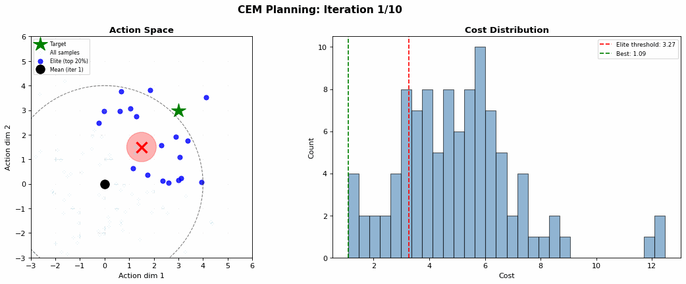 | CEM optimization: blue sample dots converging toward a green target | Samples start scattered randomly. Each iteration, the top performers are selected and the distribution shrinks. By the final iteration, samples cluster tightly around the optimal action sequence. |
| 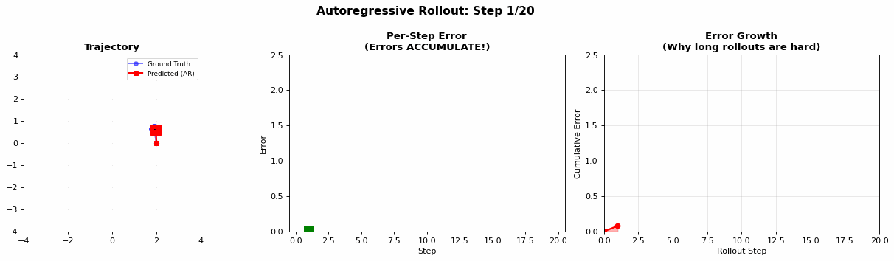 | Teacher-forcing (green) vs autoregressive (red) trajectory comparison | Teacher-forcing stays close to ground truth because it uses real observations. Autoregressive rollout drifts further from truth at each step as errors compound. Error bars grow with the planning horizon. |
| 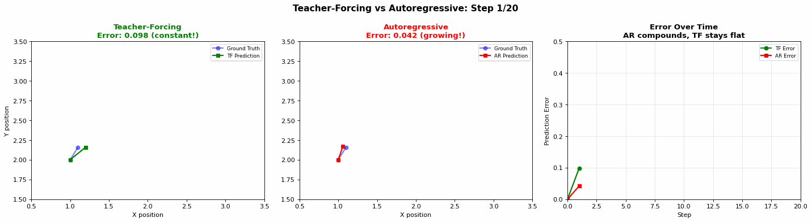 | Side-by-side comparison of teacher-forcing and autoregressive modes at each timestep | Teacher-forcing: each prediction uses the real previous state. Autoregressive: each prediction uses the model's own previous output. The divergence between the two grows over time. |
| 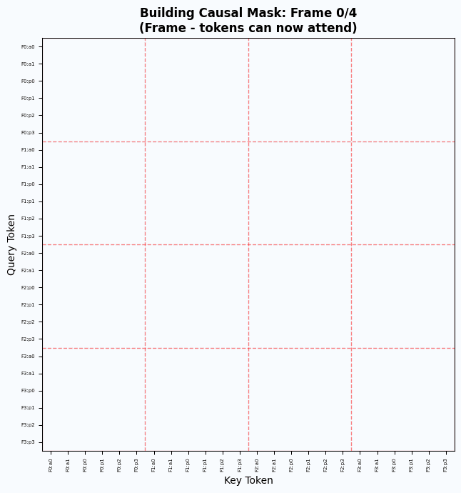 | Step-by-step construction of the frame-causal attention mask | Watch the mask build frame by frame. Each frame can attend to itself and all previous frames (white/blue) but not future frames (dark). Action tokens are interleaved between frame blocks. |
| 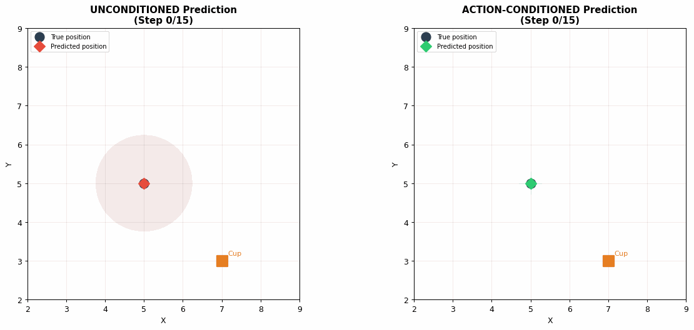 | Robot trajectory with vs without action conditioning | The conditioned model (blue) follows the intended trajectory accurately. The unconditioned model (red) drifts because it has no action information to guide its predictions. |

**Key plots:**
- **Causal mask heatmap**: Binary matrix showing the frame-level attention structure
- **Loss decomposition**: Bar/line chart showing TF loss and AR loss components during training
- **Action embedding space**: t-SNE/PCA showing how different action types cluster
- **Rollout quality vs horizon**: 3D surface showing prediction accuracy degrading with longer horizons

---

### Notebook 04: VLA-JEPA Integration

**Animated GIFs and Static Visualizations:**

| GIF / Image | What It Shows | What to Observe |
|-------------|---------------|-----------------|
| 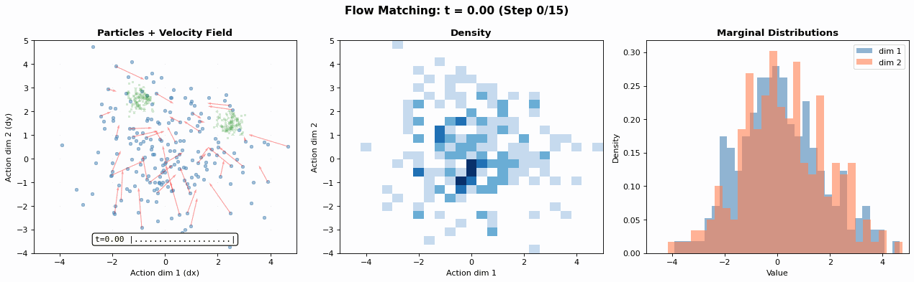 | Noise particles being denoised into a bimodal action distribution via learned velocity fields | Blue dots start as random noise. Red arrows show the velocity field guiding them. Dots gradually separate into two clusters representing a bimodal action distribution (e.g., grasp from left or right). |
| 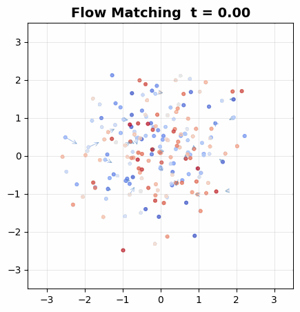 | 2D flow field with velocity vectors at multiple timesteps | Early timesteps show large, sweeping velocities. Late timesteps show small, refined adjustments. The vector field smoothly interpolates between noise and the target distribution. |
| 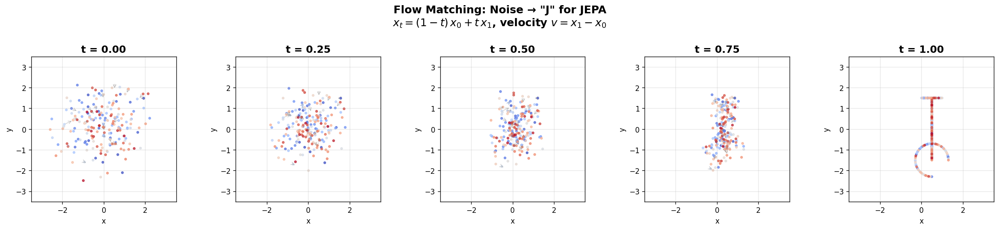 | Static snapshots of the 2D flow at key timesteps (t=0, 0.25, 0.5, 0.75, 1.0) | Shows the progression from uniform noise to structured clusters. The intermediate steps reveal how the flow field organizes particles. |
| 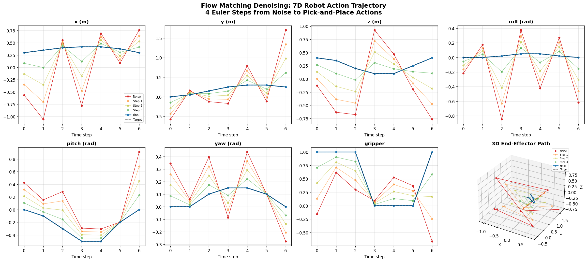 | All 7 action dimensions denoising simultaneously | Each subplot shows one DoF (x, y, z, roll, pitch, yaw, gripper) transitioning from noise to a target value. All dimensions converge by t=1.0. |
| 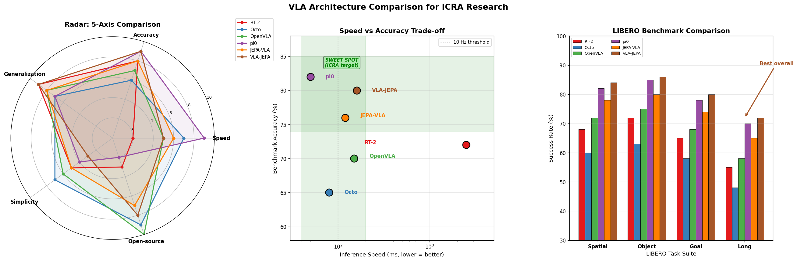 | Architecture comparison of 6 VLA models side-by-side | Compares RT-2, Octo, OpenVLA, pi0, JEPA-VLA, and VLA-JEPA across architecture, training data, action representation, and LIBERO performance. |
| 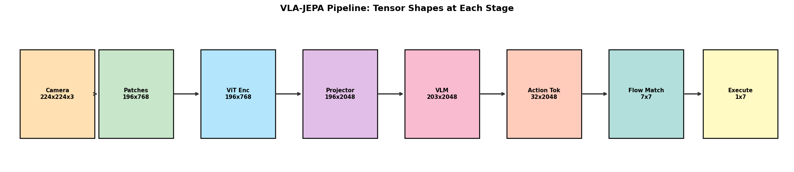 | End-to-end tensor shape diagram for the VLA pipeline | Traces shapes from raw image input through patch embedding, encoder, cross-attention with language, flow matching, and final action output. Every intermediate tensor shape is labeled. |

---

### Notebook 05: ICRA Research Gaps

**Animated GIFs:**

| GIF | What It Shows | What to Observe |
|-----|---------------|-----------------|
| 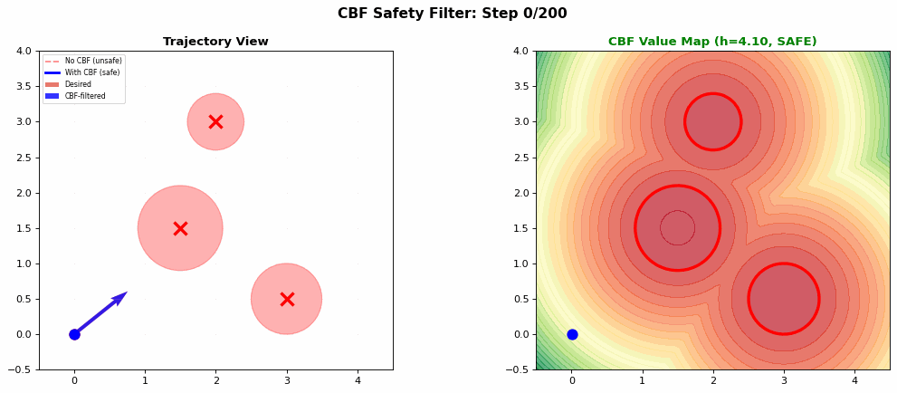 | Unsafe trajectory (red dashed) vs CBF-filtered safe trajectory (blue solid) | The unsafe path cuts through obstacle regions. The CBF safety filter bends the trajectory around obstacles while staying as close as possible to the original goal. The CBF value bar shows safety margin in real time. |
| 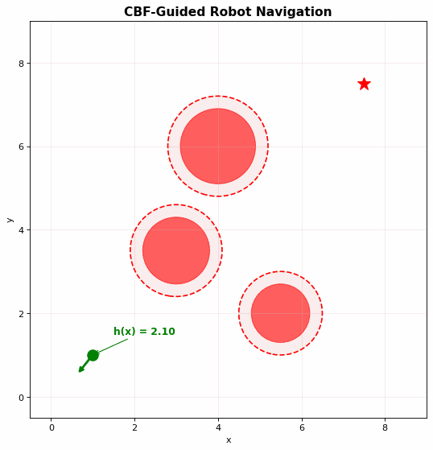 | Real-time CBF-guided navigation with multiple obstacles | Watch the agent navigate a cluttered environment. The CBF activates (color change) whenever the agent approaches an obstacle, smoothly redirecting it while maintaining progress toward the goal. |

**Static Visualizations:**

| Image | What It Shows | What to Observe |
|-------|---------------|-----------------|
| 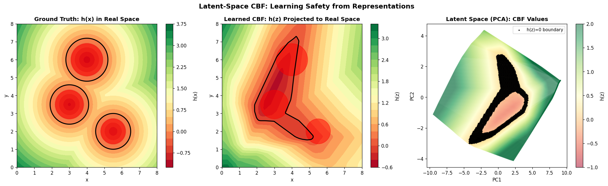 | 4-panel plot: latent space with CBF safety boundaries, safe/unsafe regions, action corrections | Shows how a CBF defined in latent representation space creates safety regions that the robot policy must respect. The QP solver minimally modifies unsafe actions to satisfy the CBF constraint. |
| 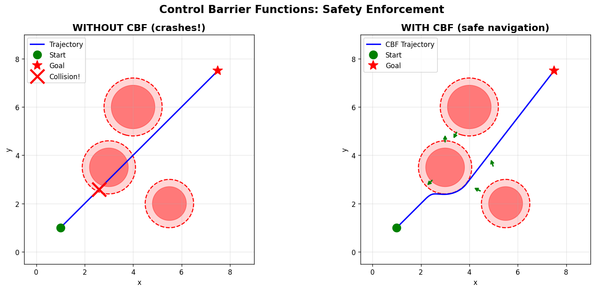 | Side-by-side: standard policy vs CBF-augmented policy | The standard policy occasionally violates safety constraints. The CBF-augmented policy maintains the safety invariant at all times with minimal performance degradation. |
| 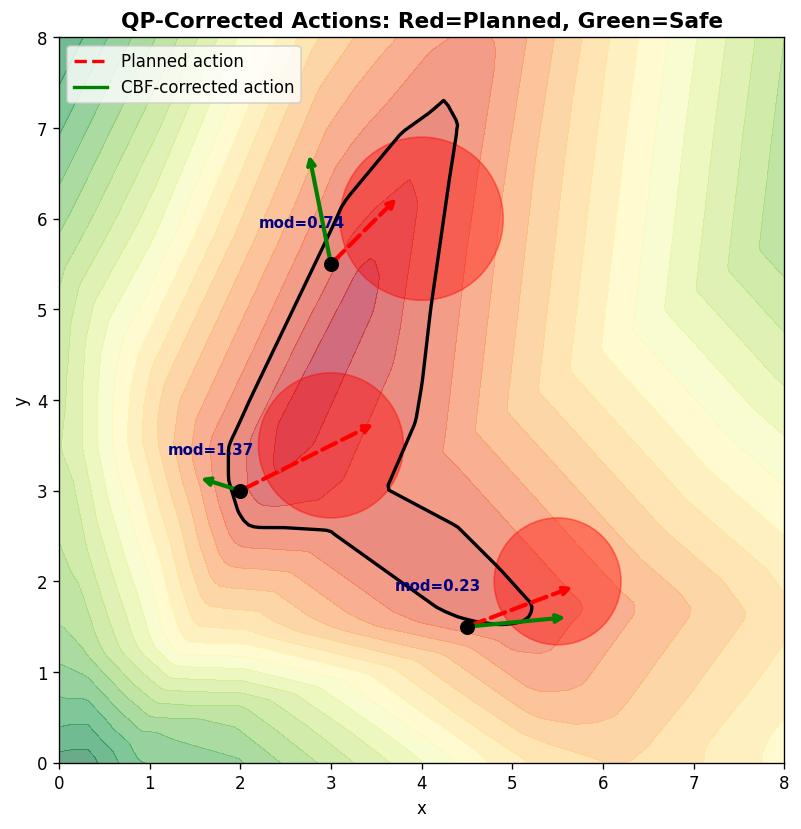 | How the quadratic program modifies unsafe actions | Shows the original action vector, the CBF constraint boundary, and the corrected action. The correction is minimal (closest safe action). |
| 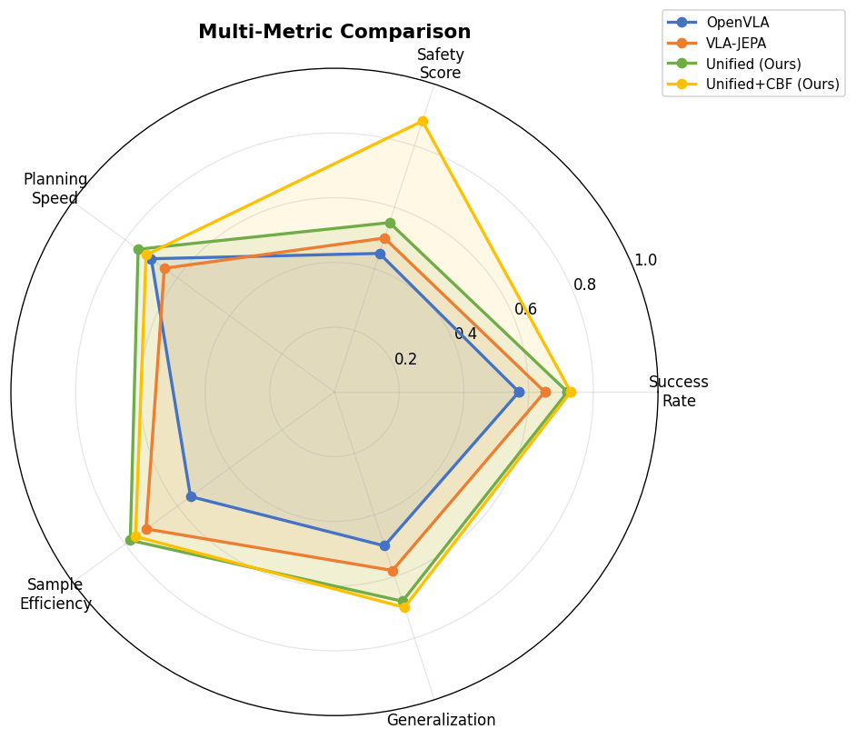 | 4 paper ideas compared across 5 dimensions | Axes: novelty, feasibility, impact, risk, publication readiness. The Unified JEPA-VLA idea scores highest overall. |
| 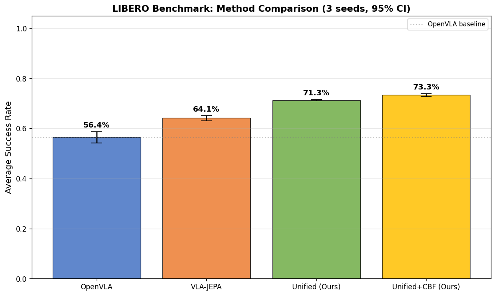 | Expected LIBERO benchmark results for ablation study | Bar chart showing projected success rates for baseline, JEPA-VLA only, VLA-JEPA only, and Unified approaches across LIBERO-Spatial, Object, Goal, Long. |
| 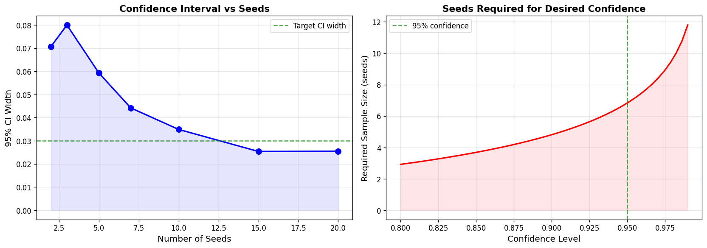 | Power analysis for experiment design | Shows the number of evaluation episodes needed to detect a statistically significant improvement at various effect sizes. Helps determine your experiment budget. |
| 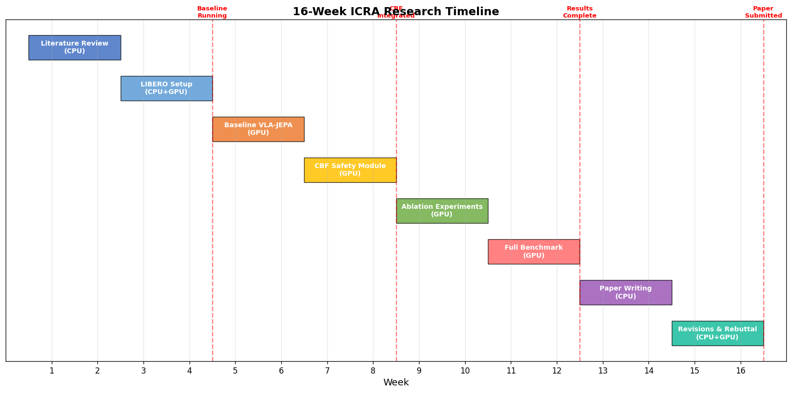 | 16-week ICRA research timeline | 4 phases: reproduce baselines (weeks 1-4), build unified model (5-8), full experiments (9-12), write paper (13-16). Each phase has specific milestones. |
| 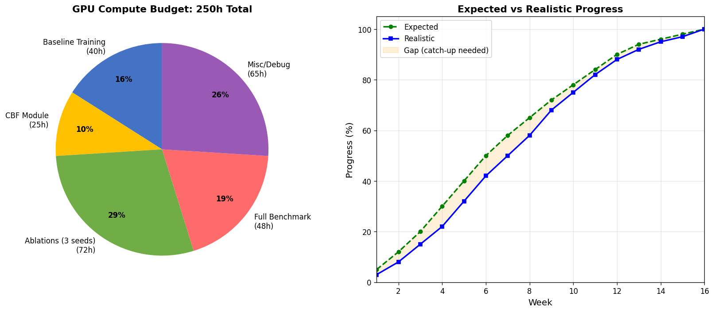 | GPU hours and compute budget estimation | Breaks down training time for pretraining, fine-tuning, and evaluation across different model sizes. |
| 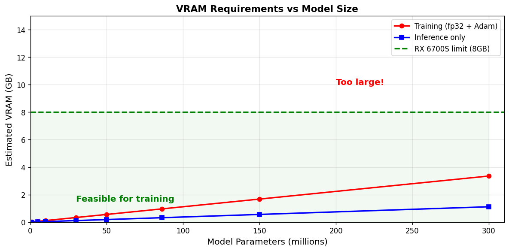 | VRAM requirements for different V-JEPA 2 model sizes | Shows which models fit in 8 GB (your hardware), 16 GB, 24 GB, and 80 GB. V-JEPA 2-Small fits in 8 GB with batch size adjustments. |

---

## 5. Formula Reference Card

| Formula | Notation | Plain English | Notebook |
|---------|----------|---------------|----------|
| **Scaled Dot-Product Attention** | `Attention(Q,K,V) = softmax(QK^T / sqrt(d_k)) V` | Each token computes similarity scores with all other tokens, normalizes them, and takes a weighted average of values. The `sqrt(d_k)` prevents dot products from growing too large. | 01, 02 |
| **L1 Loss (MAE)** | `L = (1/N) sum |z_predicted - z_target|` | Average absolute difference between predicted and target representations. More robust to outliers than L2 (MSE). | 01 |
| **EMA Update** | `theta_bar <- tau * theta_bar + (1 - tau) * theta` | Target encoder parameters are a slow-moving average of the online encoder. High tau (e.g., 0.996) means the target changes slowly, providing stable training targets. | 01 |
| **Stop-Gradient** | `L = \|p(f_theta(x)) - sg[f_bar(x)]\|` | Gradients flow only through the predictor and online encoder, not through the target encoder. This asymmetry prevents representational collapse (where the model outputs a constant). | 01 |
| **RoPE (Rotary Position Embedding)** | `RoPE(x, pos) = R(pos) * x` where `R` is a block-diagonal rotation matrix with angles `theta_i = pos / 10000^(2i/d)` | Encodes position by rotating embedding dimensions in pairs. The dot product between two rotated vectors depends on their relative position, not absolute position. Extended to 3D (time, height, width) for video. | 02 |
| **SwiGLU** | `SwiGLU(x) = (x * W1) * silu(x * W_gate) * W2` where `silu(x) = x * sigmoid(x)` | A gated feed-forward layer: one linear path provides content, another provides a gate that controls information flow. Outperforms standard ReLU FFNs. | 02 |
| **Rescaled Init** | `W_l = W_l / sqrt(2 * L)` where `L` = number of layers | Scales initial weights by the inverse square root of twice the depth. Prevents activation magnitudes from growing as signals pass through many residual blocks. | 02 |
| **Teacher-Forcing Loss** | `L_TF = sum_t \|pred(s_t, a_t) - sg[target(s_{t+1})]\|` | At each timestep, the model receives the real state and real action, and must predict the next state's target representation. Errors do not compound. | 03 |
| **Autoregressive Loss** | `L_AR = sum_t \|rollout_t - sg[target(s_{t+1})]\|` where `rollout_t = pred(rollout_{t-1}, a_t)` | The model uses its own previous predictions as input instead of ground truth. Forces the model to be robust to its own errors, since at test time it only has its own predictions. | 03 |
| **Combined Loss (V-JEPA 2-AC)** | `L = L_TF + lambda * L_AR` | Balances faithful one-step prediction (TF) with robust multi-step rollout (AR). Lambda controls the tradeoff; typically lambda=1.0. | 03 |
| **CEM Energy** | `E(a_{1:H}) = sum_t \|rollout_t - z_goal\|` | Measures how close the predicted future states (given an action sequence) are to the desired goal state. CEM minimizes this by iteratively sampling, ranking, and refitting action distributions. | 03 |
| **Flow Matching Loss** | `L_FM = E_t,x0,x1[\|v_theta(t, phi_t(x)) - (x1 - x0)\|^2]` where `phi_t(x) = (1-t)*x0 + t*x1` | Learn a velocity field that transports noise (x0) to target actions (x1) along straight paths. At inference, integrate the velocity field from t=0 to t=1 using an ODE solver to generate actions. | 04 |
| **CBF Constraint** | `dh/dt(x) + alpha * h(x) >= 0` where `h(x) > 0` defines the safe set | A Control Barrier Function h(x) defines safe regions (h > 0). The constraint ensures the system never leaves the safe set by requiring h to decrease no faster than exponentially. Enforced via a QP that minimally modifies unsafe actions. | 05 |
| **Latent CBF** | `h(z) = h(f_theta(x))` where `z` is the JEPA latent representation | Apply CBF safety in the learned representation space instead of raw state space. The JEPA encoder maps states to a latent space where safety boundaries may be simpler to define. | 05 |

---

## 6. Glossary

| Term | Definition | Notebook |
|------|------------|----------|
| **ACBlock** | Action-Conditioned transformer Block -- extends the standard transformer block to accept interleaved action tokens with separate RoPE treatment | 03 |
| **ACRoPEAttention** | Variant of RoPE attention that applies different position encodings to spatial tokens vs action tokens | 03 |
| **Action Chunking** | Predicting multiple future actions at once (e.g., 4-16 steps) instead of one at a time, reducing compounding error and improving temporal consistency | 04 |
| **Action Conditioning** | Feeding robot action vectors into the predictor so it can forecast what will happen if a specific action is taken | 03 |
| **Amortized Planning** | Distilling expensive CEM planning into a fast feedforward policy network, removing the need for iterative optimization at test time | 05 |
| **Attention Mask** | Binary matrix controlling which tokens can attend to which other tokens; causal masks prevent attending to future tokens | 02, 03 |
| **Autoregressive (AR)** | Generation mode where each prediction depends on the model's own previous predictions, not ground truth | 03 |
| **Backbone** | The main feature extraction network in a VLA (typically a ViT or ResNet) | 04 |
| **BatchNorm** | Normalization across the batch dimension; used in CNNs but not transformers (which use LayerNorm instead) | 01 |
| **CBF (Control Barrier Function)** | A mathematical function that certifies a region of state space as safe and enforces that the system never leaves it via a real-time QP | 05 |
| **CEM (Cross-Entropy Method)** | Derivative-free optimization: sample action sequences, evaluate them with the world model, keep the best, refit the sampling distribution, repeat | 03 |
| **CKA (Centered Kernel Alignment)** | A metric for comparing the representations learned by different layers, regardless of rotation or scaling | 02 |
| **Collapse (Representation)** | Failure mode where the encoder outputs the same representation for all inputs, making the loss trivially zero but learning nothing useful | 01 |
| **DROID Dataset** | 62 hours of diverse robot manipulation data used to train V-JEPA 2-AC | 03 |
| **EMA (Exponential Moving Average)** | A smoothing technique where the target encoder's weights are a running average of the online encoder's weights; provides stable training targets | 01 |
| **Encoder** | The online network f_theta that processes visible/context patches and produces representations | 01 |
| **Exposure Bias** | The mismatch between training (teacher-forcing with real inputs) and inference (autoregressive with model outputs), causing error accumulation | 03 |
| **Flow Matching** | A generative modeling approach that learns a velocity field to transport noise into a target distribution along straight interpolation paths | 04 |
| **Frame-Causal** | Attention pattern where each video frame can attend to current and past frames but not future frames, enabling autoregressive prediction | 03 |
| **Gated Cross-Attention** | A mechanism for fusing information from two modalities (e.g., vision and language) with a learnable gate controlling information flow | 04 |
| **Gather Operation** | The `apply_masks` function that selects specific patch embeddings by index, used to extract context or target patches after masking | 01 |
| **I-JEPA** | Image-JEPA -- the original JEPA for static images, predicting masked patch representations from visible patches | 01 |
| **JEPA (Joint Embedding Predictive Architecture)** | A self-supervised learning framework where a predictor network predicts the representation of masked content from visible content, all in latent space | 01 |
| **JEPA-VLA** | The "feature injection" approach: use V-JEPA 2 as a frozen feature extractor and plug its representations into an existing VLA backbone | 04 |
| **Kurtosis** | A statistical measure of the "tailedness" of a distribution; used to analyze activation health in neural networks | 01 |
| **L1 Loss (MAE)** | Mean Absolute Error -- the average of absolute differences between predictions and targets; more robust to outliers than L2 | 01 |
| **L2 Loss (MSE)** | Mean Squared Error -- penalizes large errors more heavily than L1; can overweight outliers in representation learning | 01 |
| **LayerNorm** | Normalization across the feature dimension (per-token); standard in transformers because it works with variable sequence lengths | 01, 02 |
| **Leakage-Free** | A design constraint ensuring the world model cannot see future observations during training, preventing it from learning to copy instead of predict | 04 |
| **LIBERO** | A benchmark suite for robot manipulation with 4 sub-benchmarks: Spatial, Object, Goal, and Long-horizon tasks | 04, 05 |
| **LogSumExp Trick** | Numerical trick for computing log(sum(exp(x))) stably by subtracting the maximum value before exponentiating | 01 |
| **MHA (Multi-Head Attention)** | Splitting the attention computation into multiple parallel heads, each with its own Q/K/V projections, allowing the model to attend to different aspects simultaneously | 02 |
| **Multi-Block Masking** | The masking strategy in JEPA that removes multiple contiguous blocks of patches, forcing the model to predict large regions from limited context | 01 |
| **ODE Solver** | Ordinary Differential Equation solver used in flow matching to integrate the learned velocity field from noise to actions at inference time | 04 |
| **Patch Embedding** | Converting a small spatial (or spatiotemporal) region of an image/video into a single token vector via linear projection | 01, 02 |
| **PatchEmbed3D** | The 3D patch embedding layer that converts video clips into sequences of tokens using a 3D convolution | 02 |
| **Predictor** | A small network that takes context token representations and predicts target token representations; smaller than the encoder to avoid trivial shortcuts | 01, 02 |
| **Pre-Norm** | Applying LayerNorm before (rather than after) each sub-layer in a transformer block; improves training stability | 01, 02 |
| **QP (Quadratic Program)** | An optimization problem that minimally modifies an unsafe action to satisfy CBF constraints; solved in real time during robot control | 05 |
| **Rescaling Trick** | Dividing initial weights by sqrt(2L) where L is the number of layers, preventing activation magnitudes from growing with depth | 02 |
| **Residual Connection** | Adding the input of a sub-layer to its output (x + f(x)), allowing gradients to flow directly through the network and enabling deeper architectures | 01, 02 |
| **Residual Stream** | The conceptual view of a transformer as a single vector being incrementally updated by each layer, rather than a chain of complete transformations | 02 |
| **RoPE (Rotary Position Embedding)** | A position encoding method that rotates embedding dimensions by angles proportional to position, so that attention scores depend on relative position | 02 |
| **Sim-to-Real Transfer** | Training in simulation and deploying on real hardware; JEPA world models may bridge the sim-real gap by learning domain-invariant representations | 05 |
| **Stop-Gradient (sg)** | An operation that blocks gradient flow through the target encoder, creating the asymmetry that prevents representation collapse | 01 |
| **SwiGLU** | Swish-Gated Linear Unit -- a feed-forward activation combining a linear path with a Swish-gated path; used in V-JEPA 2 instead of ReLU or GELU | 02 |
| **Target Encoder** | The EMA copy of the online encoder that produces training targets; updated slowly to provide stable learning signals | 01 |
| **Teacher-Forcing (TF)** | Training mode where the model receives ground-truth inputs at each step rather than its own predictions; avoids error accumulation during training | 03 |
| **t-SNE** | t-distributed Stochastic Neighbor Embedding -- a dimensionality reduction technique for visualizing high-dimensional representations in 2D or 3D | 01 |
| **Token Interleaving** | The technique of inserting action tokens between frame token blocks in the sequence, allowing the model to attend to both visual and action information | 03 |
| **UMAP** | Uniform Manifold Approximation and Projection -- another dimensionality reduction technique, often faster than t-SNE with better global structure preservation | 01 |
| **V-JEPA** | Video-JEPA -- extending I-JEPA to video with spatiotemporal masking and temporal attention | 01 |
| **V-JEPA 2** | The second generation Video-JEPA with ViT-giant encoder, 3D RoPE, SwiGLU, and rescaled initialization; achieves state-of-the-art self-supervised video representations | 02 |
| **V-JEPA 2-AC** | Action-Conditioned V-JEPA 2 -- the robotics extension that conditions predictions on robot actions, enabling latent-space planning and zero-shot control | 03 |
| **ViT (Vision Transformer)** | A transformer architecture applied directly to sequences of image patches, replacing convolutions with self-attention | 02 |
| **VLA (Vision-Language-Action)** | A model that takes visual observations and language instructions as input and produces robot actions as output | 04 |
| **VLA-JEPA** | The "world model" approach: build a VLA that internally uses a JEPA world model for state prediction, with a leakage-free design | 04 |
| **VL-JEPA** | Vision-Language JEPA -- extending JEPA to jointly learn from visual and language inputs | 01 |
| **World Model** | A neural network that predicts future states given current state and action; enables planning by imagining outcomes before acting | 03 |
| **7-DoF** | Seven Degrees of Freedom -- a standard robot arm action space: 3 translation (x,y,z) + 3 rotation (roll,pitch,yaw) + 1 gripper | 03 |

---

## 7. Reference Papers

### Must-Cite Papers

| Paper | Year | Key Contribution | Link |
|-------|------|------------------|------|
| A Path Towards Autonomous Machine Intelligence (LeCun) | 2022 | Introduced the JEPA concept and the vision for self-supervised world models | [OpenReview](https://openreview.net/pdf?id=BZ5a1r-kVsf) |
| I-JEPA: Self-Supervised Learning from Images with a Joint-Embedding Predictive Architecture | 2023 | First JEPA implementation for images; multi-block masking, predictor design | [arXiv:2301.08243](https://arxiv.org/abs/2301.08243) |
| V-JEPA: Video Joint Embedding Predictive Architecture | 2024 | Extended JEPA to video with spatiotemporal masking | [Meta AI Blog](https://ai.meta.com/blog/v-jepa-yann-lecun-ai-model-video-joint-embedding-predictive-architecture/) |
| V-JEPA 2: Self-Supervised Video Models Enable Understanding, Prediction, and Planning | 2025 | ViT-giant, 3D RoPE, SwiGLU, action-conditioned world model, zero-shot robotics | [arXiv:2506.09985](https://arxiv.org/abs/2506.09985) |
| JEPA-VLA: Empowering Vision-Language-Action Models with JEPA | 2026 | Feature injection approach: plug V-JEPA 2 features into existing VLAs | [arXiv:2602.11832](https://arxiv.org/abs/2602.11832) |
| VLA-JEPA: A World-Model-Integrated Vision-Language-Action Architecture | 2026 | World model approach: leakage-free JEPA world model + flow matching action head | [arXiv:2602.10098](https://arxiv.org/abs/2602.10098) |

### Should-Cite Papers

| Paper | Year | Key Contribution | Link |
|-------|------|------------------|------|
| An Image is Worth 16x16 Words (ViT) | 2021 | Vision Transformer: applying transformers to image patches | [arXiv:2010.11929](https://arxiv.org/abs/2010.11929) |
| RoFormer: Enhanced Transformer with Rotary Position Embedding | 2021 | Rotary Position Embedding for relative position encoding | [arXiv:2104.09864](https://arxiv.org/abs/2104.09864) |
| GLU Variants Improve Transformer | 2020 | SwiGLU and other gated activations for transformer FFNs | [arXiv:2002.05202](https://arxiv.org/abs/2002.05202) |
| Flow Matching for Generative Modeling | 2023 | Flow matching as a simpler alternative to diffusion for generative models | [arXiv:2210.02747](https://arxiv.org/abs/2210.02747) |
| BarrierNet: Differentiable CBF Layers for Safe RL | 2023 | Integrating CBFs as differentiable layers in neural network policies | [arXiv:2206.07052](https://arxiv.org/abs/2206.07052) |
| RT-2: Vision-Language-Action Models | 2023 | VLA that uses a large VLM backbone to output robot actions | [arXiv:2307.15818](https://arxiv.org/abs/2307.15818) |
| Octo: An Open-Source Generalist Robot Policy | 2024 | Open-source multi-robot VLA with diffusion action head | [arXiv:2405.12213](https://arxiv.org/abs/2405.12213) |
| OpenVLA: Open-Source Vision-Language-Action Model | 2024 | 7B parameter open-source VLA fine-tuned from Prismatic VLM | [arXiv:2406.09246](https://arxiv.org/abs/2406.09246) |
| pi0: A Vision-Language-Action Flow Model for General Robot Control | 2024 | Flow matching VLA with pre-trained VLM backbone | [Physical Intelligence](https://www.physicalintelligence.company/blog/pi0) |

---

## 8. Hardware and Compute

### Tested Configuration

- **GPU:** AMD Radeon RX 6700S (8 GB VRAM) + integrated Radeon
- **OS:** Windows 11 Home
- **CPU:** AMD64
- **Python:** 3.11
- **PyTorch:** CPU build (all notebooks run on CPU)

### Compute Requirements

| What | CPU Time | Notes |
|------|----------|-------|
| Run all 5 notebooks end-to-end | 15-30 minutes | Toy models with small datasets |
| Generate all GIFs | Included above | GIFs are created inline during notebook execution |
| Total study time (reading + running + exercises) | 20-30 hours | Spread across 5 days |

### For ICRA Research (Beyond Studying)

| Task | Hardware | Time |
|------|----------|------|
| Reproduce VLA-JEPA baselines | 1x A100 80 GB or equivalent | ~1 week |
| Train Unified JEPA-VLA | 1-4x A100 | ~2-3 weeks |
| LIBERO evaluation suite | 1x GPU (8+ GB) | ~1-2 days |
| V-JEPA 2-Small fine-tuning | AMD RX 6700S 8 GB (with batch size 1-2) | ~1 week |

### Model VRAM Requirements

| Model | Parameters | Min VRAM | Fits 8 GB? |
|-------|-----------|----------|------------|
| V-JEPA 2-Small | ~22M | ~2 GB | Yes |
| V-JEPA 2-Large | ~307M | ~8 GB | Tight (batch=1) |
| V-JEPA 2-Huge | ~632M | ~16 GB | No |
| V-JEPA 2-giant | ~1.1B | ~24 GB | No |

---

## Project Structure

```
JEPAstudy/
  README.md                              # This file
  pyproject.toml                         # Python project config (dependencies)
  uv.lock                               # Lockfile for uv package manager
  notebooks/
    01_JEPA_Fundamentals.ipynb           # 92 cells - JEPA from scratch
    02_VJEPA2_Architecture.ipynb         # 62 cells - ViT deep dive
    03_VJEPA2_AC_WorldModel.ipynb        # 52 cells - Action-conditioned world model
    04_VLA_JEPA_Integration.ipynb        # 43 cells - JEPA + VLA integration
    05_ICRA_Research_Gaps.ipynb          # 45 cells - Research gaps & paper ideas
    gifs/                                # Generated GIFs and static plots
      01_ema_comparison.gif
      01_collapse_vs_healthy.gif
      01_gradient_backprop.gif
      01_masking_strategies.gif
      01_loss_landscape_evolution.gif
      02_attention_through_layers.gif
      02_weight_init.gif
      02_init_comparison.gif
      03_cem_planning.gif
      03_rollout_error.gif
      03_tf_vs_ar.gif
      03_causal_mask.gif
      03_action_conditioning.gif
      04_flow_matching.gif
      04_flow_2d.gif
      04_flow_2d_snapshots.png
      04_flow_7d_denoising.png
      04_vla_comparison.png
      04_vla_pipeline_trace.png
      05_cbf_safety.gif
      05_cbf_navigation.gif
      05_cbf_comparison.png
      05_cbf_qp_correction.png
      05_latent_cbf.png
      05_radar_chart.png
      05_experiment_bars.png
      05_statistical_power.png
      05_gantt_chart.png
      05_compute_plan.png
      05_vram_estimation.png
  refs/
    vjepa2/                              # V-JEPA 2 source code (facebookresearch/vjepa2)
    VLA-JEPA/                            # VLA-JEPA implementation (ginwind/VLA-JEPA)
```

---

## ICRA Paper Direction

Notebook 05 proposes 4 paper ideas. The recommended direction:

**"Unified JEPA-VLA: Combining Feature Injection and World Models for Robot Manipulation"**

- Combines JEPA-VLA (better visual features via V-JEPA 2) + VLA-JEPA (planning via latent world model)
- Complete architecture pseudo-code in Notebook 05
- Ablation study design with projected LIBERO benchmark results
- 16-week implementation roadmap
- Feasible on AMD Radeon RX 6700S (8 GB VRAM) using V-JEPA 2-Small

---

## License

This study guide is for educational and research purposes. Reference code in `refs/` retains its original licenses (CC-BY-NC for V-JEPA 2, MIT for VLA-JEPA).
